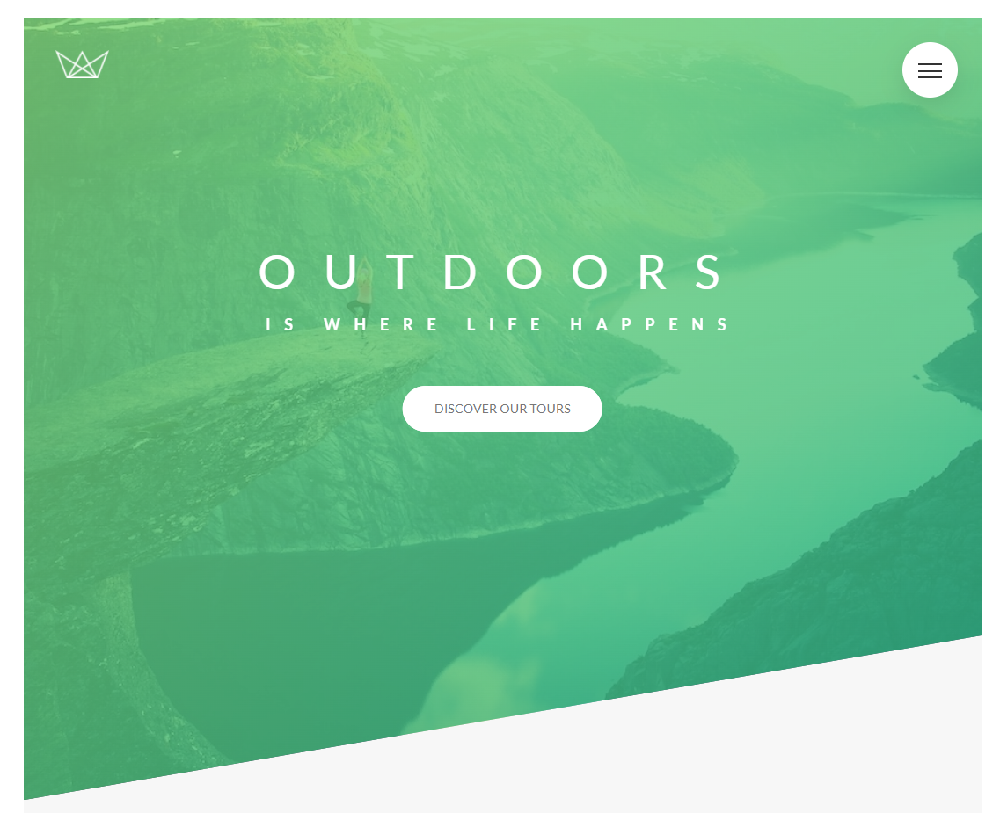
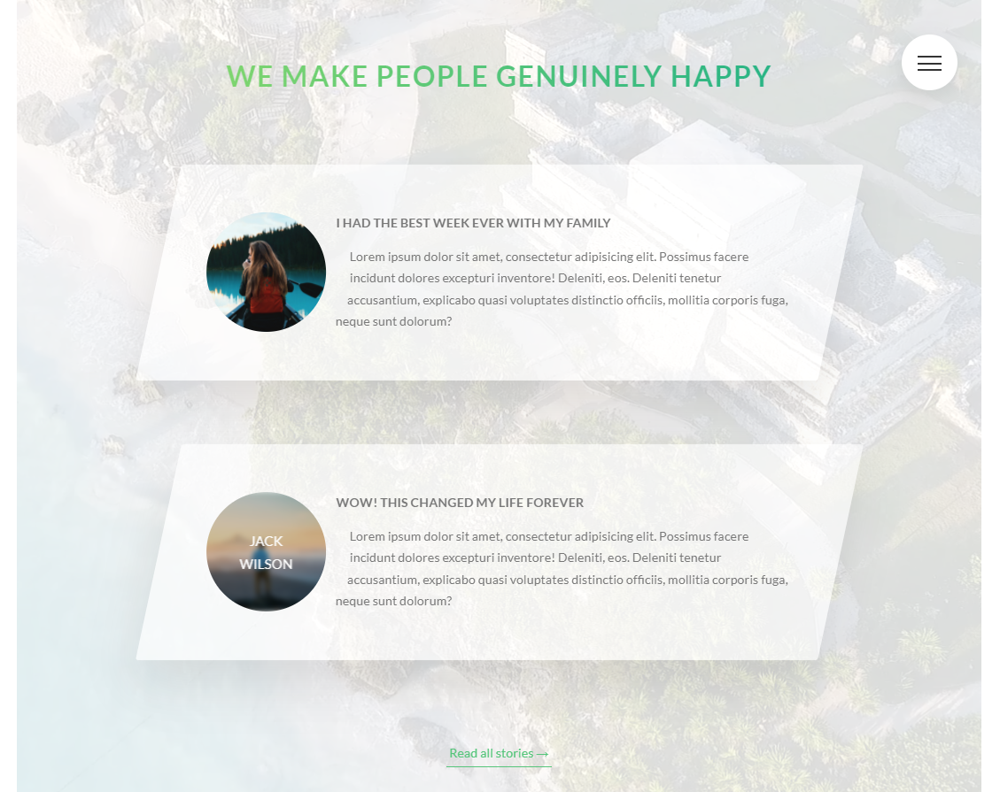
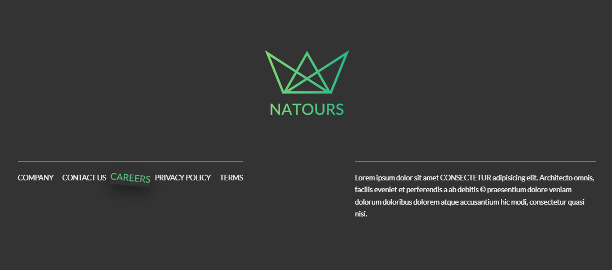

# Natours
A website built for learning SASS (SCSS)

[Click here](https://rameshx.github.io/advanced-css/) to view it in browser

## Technologies used

- SASS (SCSS)
- HTML
- autoprefixer
- node-sass

## Screenshots

